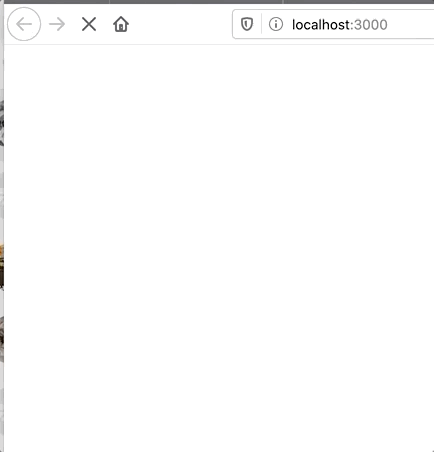

# Breakout in React

I have virtually no experience with modern web development, so thought I could learn a bit by trying to build a rudimentary version of Atari's Breakout, in React.  (Once upon a time, and a very long time ago indeed, I did this in Java Swing and remember it being not so hard.)

### Progress so far

### Process notes

* I took this bouncy-ball code as a starting point: https://codesandbox.io/s/5qvyyyjrx, but had to rewrite most of it, though, to allow my components to interact.  
  * In this example, the components kept their own states, which seems like a React anti-pattern.  From what tiny bit I read it seems state should travel only one way, from parent components to children.  If two children need to share state (for example by determining whether a ball hits a paddle) then that should be coordinated by some parent component.
  * This example did show me how to render shapes, however, which I didn't know how to do (again, I basically have not done any web dev before.) 
* I had initially intended to do this in Typescript but adding in the burden of getting React to work with Typescript was too much, especially since the focus here was to understand React.  I miss Typescript.
* The code is at present a bit of a mess.  It's not tested, which is shameful.  Also its got lots of methods that take in lots of parameters, and that will get confusing before long.

I may not continue with this exercise, but even just this taught me a lot.

